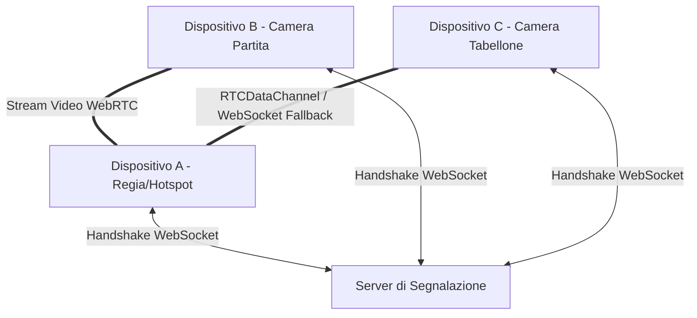

# Walkthrough — CourtCast Broadcast System MVP

Abbiamo completato con successo lo sviluppo dell'applicazione di regia per partite di basket (SPA) distribuita su tre dispositivi locali (A, B, C).

Il sistema è completamente implementato, testato localmente, offline-resilient ed ottimizzato specificamente per i vincoli di iOS Safari.

---

## Architettura e Flusso Dati

L'infrastruttura si basa su un **Signaling Server locale/cloud** e connessioni **WebRTC peer-to-peer dirette** stabilite tramite l'hotspot del Dispositivo A:

---

## Dettagli Tecnici Implementati

### 1. Registrazione Video Ultra-Stabile su iOS (OPFS)
Per evitare i limiti di memoria e i crash tipici di Safari durante lunghe sessioni di registrazione, abbiamo implementato la scrittura incrementale tramite **Origin Private File System (OPFS)**:
- **Timeslice di 1 secondo:** `MediaRecorder` genera spezzoni in continuo senza sovraccaricare la RAM del browser.
- **Worker Ausiliario Inline:** I chunk binari vengono trasferiti ad un Web Worker che esegue la scrittura sincrona non bloccante sul thread principale con `createSyncAccessHandle`.
- **Esportazione Nativa:** Al termine, il file MP4 viene chiuso ed esportato tramite la **Web Share API** (per salvare in Rullino Foto o inviare via AirDrop) o link di download diretto.
- **Screen Wake Lock:** Blocco automatico dello stand-by dello schermo per impedire la sospensione di Safari in background.

### 2. OCR locale a 7 segmenti su C (OpenCV.js)
La pipeline di visione artificiale gira interamente sul dispositivo C:
- **Calibrazione ROI Interattiva:** L'operatore seleziona il campo desiderato e tocca i 4 angoli sul canvas. I punti vengono salvati in `LocalStorage`.
- **Pre-elaborazione delle ROI:** Applicazione di prospettiva raddrizzata (`warpPerspective`), normalizzazione dei contrasti tramite equalizzazione dell'istogramma/CLAHE, e binarizzazione adattiva con soglia Otsu auto-regolante.
- **Riconoscimento Segmenti e Distanza di Hamming:** Rilevazione dello stato dei 7 segmenti LED e correzione d'errore a maggioranza per gestire rumori d'immagine (accetta fino a 1 deviazione di segmento).
- **Votazione Multi-frame e Regole Fisiche:** Votazione a maggioranza su 5 frame. Il punteggio può solo salire di 1, 2 o 3 punti; il cronometro può solo decrescere.

### 3. Sincronizzazione e Re-ancoraggio Manuale
Quando il regista su A corregge manualmente un punteggio, un fallo o il tempo:
- Il nuovo valore diventa il riferimento ufficiale ed A invia la correzione a C tramite il DataChannel WebRTC.
- C aggiorna istantaneamente la sua ancora di validazione sul nuovo valore manuale per evitare che letture OCR successive sovrascrivano la correzione (re-ancoraggio).
- La modalità manuale si disattiva automaticamente non appena l'OCR su C produce 5 frame coerenti con il nuovo valore.

---

## Registrazione della Verifica Setup

Di seguito è mostrata l'animazione della configurazione iniziale, creazione della partita, caricamento dell'overlay e generazione dinamica dei QR code per i dispositivi B e C:

---

## Elenco File Creati

- [package.json](file:///C:/Users/utente/.gemini/antigravity/brain/52bf550c-8c3a-4ace-b1b1-3e30ca17313e/package.json) — Gestione dipendenze e script.
- [server.js](file:///C:/Users/utente/.gemini/antigravity/brain/52bf550c-8c3a-4ace-b1b1-3e30ca17313e/server.js) — Server HTTP statico e segnalazione WebSocket.
- [download-opencv.js](file:///C:/Users/utente/.gemini/antigravity/brain/52bf550c-8c3a-4ace-b1b1-3e30ca17313e/download-opencv.js) — Script di download offline delle librerie esterne.
- [public/index.html](file:///C:/Users/utente/.gemini/antigravity/brain/52bf550c-8c3a-4ace-b1b1-3e30ca17313e/public/index.html) — Interfaccia utente unificata (SPA) per tutti i ruoli.
- [public/style.css](file:///C:/Users/utente/.gemini/antigravity/brain/52bf550c-8c3a-4ace-b1b1-3e30ca17313e/public/style.css) — Styling CSS responsive e premium.
- [public/app.js](file:///C:/Users/utente/.gemini/antigravity/brain/52bf550c-8c3a-4ace-b1b1-3e30ca17313e/public/app.js) — Logica client-side (WebRTC, OPFS, OpenCV.js OCR, manual overrides).
- [public/sw.js](file:///C:/Users/utente/.gemini/antigravity/brain/52bf550c-8c3a-4ace-b1b1-3e30ca17313e/public/sw.js) — Service worker per l'esecuzione in caching offline.
- [.gitignore](file:///C:/Users/utente/.gemini/antigravity/brain/52bf550c-8c3a-4ace-b1b1-3e30ca17313e/.gitignore) — File di esclusione tracciamento Git.
- [render.yaml](file:///C:/Users/utente/.gemini/antigravity/brain/52bf550c-8c3a-4ace-b1b1-3e30ca17313e/render.yaml) — File di configurazione Infrastructure as Code per Render.
- [DEPLOY.md](file:///C:/Users/utente/.gemini/antigravity/brain/52bf550c-8c3a-4ace-b1b1-3e30ca17313e/DEPLOY.md) — Manuale di installazione e deploy per l'utente.
- [setup.ps1](file:///C:/Users/utente/.gemini/antigravity/brain/52bf550c-8c3a-4ace-b1b1-3e30ca17313e/setup.ps1) — Script PowerShell interattivo per la configurazione di Git e il push.
